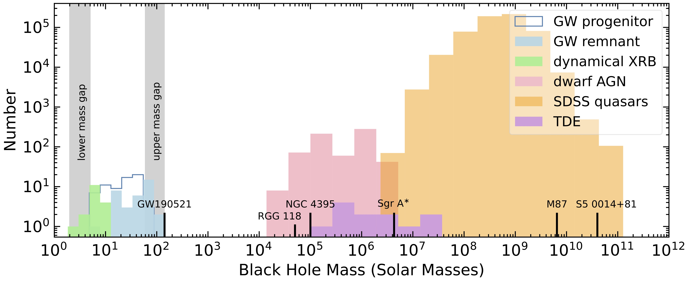

[About Me](/about.md) | [__Research__](/research.md) | [Outreach](/outreach.md) | [Talks](/talks.md)

## Overview

How did supermassive black holes form at high redshift, grow over cosmic time, and come to occupy virtually every massive galaxy in the nearby universe? In order to answer these questions, I study the black hole population using *accretion signatures*, like optical variability, in large survey data. This presents new opportunities to study active galaclic nuclei (AGN), the origin of AGN variability, and physics of black hole accretion.

## Intermediate-mass black holes

Intermediate-mass black holes (IMBHs) had to exist at some point in cosmic time to form the observed population of supermassive black holes.

Figure Caption: The observed mass spectrum of black holes.

 
Included in the figure are stellar-mass black holes with BH mass measurements from dynamical measurements in X-ray binary (XRB) systems (Corral-Santana et al. 2016), confidently-detected gravitational wave (GW) events (LIGO-Virgo 2021), supermassive black holes from SDSS quasars with single-epoch BH mass estimates (Wu & Shen 2022), broad-line dwarf AGNs with single-epoch BH mass estimates (Greene et al. 2007, Reines et al. 2013, Liu et al. 2018, Chilingarian et al. 2018), and tidal disruption events (TDEs) with BH masses estimated from the stellar velocity dispersion of their host galaxy bulges (Wevers et al. 2017). The lower mass gap refers to the scarcity of BHs observed below ~ 5 Solar masses and above the maximum possible mass of a neutron star (see e.g., Kreidberg et al. 2012). The upper mass gap results from predictions from stellar evolution that pair instability supernova leave no BH remnant above ~ 140 Solar masses (e.g., Woosley et al. 2017). For reference, we include some well known sources with measured BH masses, GW190521 (LIGO-Virgo 2020) RGG 118 (Baldassare et al. 2015), NGC 4395 (Filippenko et al. 2003), Sgr A* (EHT 2022), M87 (EHT 2019), and the luminous blazar S5 0014+81 (Kuhr et al. 1983, Ghisellini et al. 2009). The IMBH ``mass desert'' is evident. This figure is adapted from an illustrative version in Colpi (2017).

### AGN Variability

I use optical imaging surveys to study the variability (or "flickering") of active galactic nuclei (AGNs) and gain new insights into their central engines. Our recent work establishes a mass-timescale relation, whereby AGN variability can be used to estimate the mass of the central black hole. It was published in the journal _Science_ (also see articles in [_Popular Science_](https://www.popsci.com/space/weigh-black-hole/), [_Science News_](https://www.sciencenews.org/article/black-holes-mass-measure-new-technique-accretion-disk), and [_space.com_](https://www.space.com/black-hole-feeding-pattern-mass-size)):

[C. J. Burke et al. _Science_ 373(6556), 789 (2021)](https://science.sciencemag.org/content/373/6556/789).

Image Credit: Mark A. Garlick/Simons Foundation

Also see our work on the variability of the "poster-child" dwarf AGN NGC 4395: [C. J. Burke et al. _ApJ_ 899, 136 (2020)](https://ui.adsabs.harvard.edu/abs/2020ApJ...899..136B/abstract).

[Watch Caltech Seminar](https://youtu.be/dah-HsGfUMk)

### Other Time-Domain Astrophysics

During our search, we also found a peculiar long-lived stellar transient in the metal-poor galaxy PHL 293B. I collaborated with Prof. Vivienne Baldassare to study this perplexing dwarf galaxy. Using data we obtained from the Gemini Observatory, we found the unusually-luminous broad Balmer emission has begun to fade away in recent years. We concluded the variability, despite appearing similar to that of an AGN, is actually likely due to a massive outburst of a luminous blue variable star, resembling the transient event SDSS1133. Our observations ruled-out some interpretations put-forth in previous papers.

**C. J. Burke**, V. F. Baldassare, X. Liu, et al. "The curious case of PHL 293B: A long-lived transient in a metal-poor blue compact dwarf galaxy." [ApJ Letters 894, L5 (2020)](https://ui.adsabs.harvard.edu/abs/2020ApJ...894L...5B/abstract}).

### Machine Learning 

I collaborated with Patrick Aleo to adapt a new machine learning code to classify and deblend sources using the "Mask R-CNN" architecture for image segmentation. I have also had the privilege of mentoring and advising two undergraduate students, Anshul Shah ([view SPIN poster](https://nbviewer.jupyter.org/github/burke86/burke86.github.io/blob/master/assets/SPIN_Poster.pdf)) and Yufeng Liu, through the [NCSA SPIN](http://spin.ncsa.illinois.edu/) research program.

**C. J. Burke**, P. D. Aleo, X. Liu, et al. "Deblending and Classifying Astronomical Sources with Mask R-CNN Deep Learning." [MNRAS 490, 3953 (2019)](https://doi.org/10.1093/mnras/stz2845).

G. M. Merz, Y. Liu, **C. J. Burke**, et al. "Detection, Instance Segmentation, and Classification for Astronomical Surveys with Deep Learning (DeepDISC): Detectron2 Implementation and Demonstration with Hyper Suprime-Cam Data"

<!--- ## Undergraduate Work

I worked with [Professor John R. Peterson](https://lsst.rcac.purdue.edu/) at Purdue for over three years, developing and improving the [Photon Simulator (PhoSim)](https://bitbucket.org/phosim/phosim_release/wiki/Home) software for use with modeling a variety of telescopes, including the James Webb Space Telescope, the Large Synoptic Survey Telescope, and the WIYN 3.5-meter telescope. Our goal is for these physics-based models to help better-constrain [weak lensing](https://en.wikipedia.org/wiki/Weak_gravitational_lensing) studies as well as providing high-fidelity mock data to test image pipelines. 

I extended PhoSim's code for use with internal simulations of the Near-Infrared Camera. My work resulted in a small contract for our group from our collaborators at the University of Arizona. I earned the [Richard W. King award](http://www.physics.purdue.edu/about/prizes_awards/undergraduate_awards.html#King) for my work.

Close-up of NIRCam SW (left) and LW (right) channel optical models in PhoSim. Rays are shown propagating through the camera's mirrors, lenses, dichroic filter, and two focal planes.

See our [PhoSim-NIRCam paper](https://www.spiedigitallibrary.org/journals/Journal-of-Astronomical-Telescopes-Instruments-and-Systems/volume-5/issue-3/038002/PhoSim-NIRCam--photon-by-photon-image-simulations-of-the/10.1117/1.JATIS.5.3.038002.short?SSO=1) for details.

I also completed multiple nights of observations at the WIYN 3.5-meter Telescope at Kitt Peak National Observatory in Arizona using the One Degree Imager (ODI) instrument. As part of our work, I performed initial modeling the WIYN/ODI optical system in PhoSim, with the goal of calibrating the physics in PhoSim. See our [paper on deformation of optics for photon Monte Carlo simulations](https://iopscience.iop.org/article/10.3847/1538-4357/ab0418). --->
